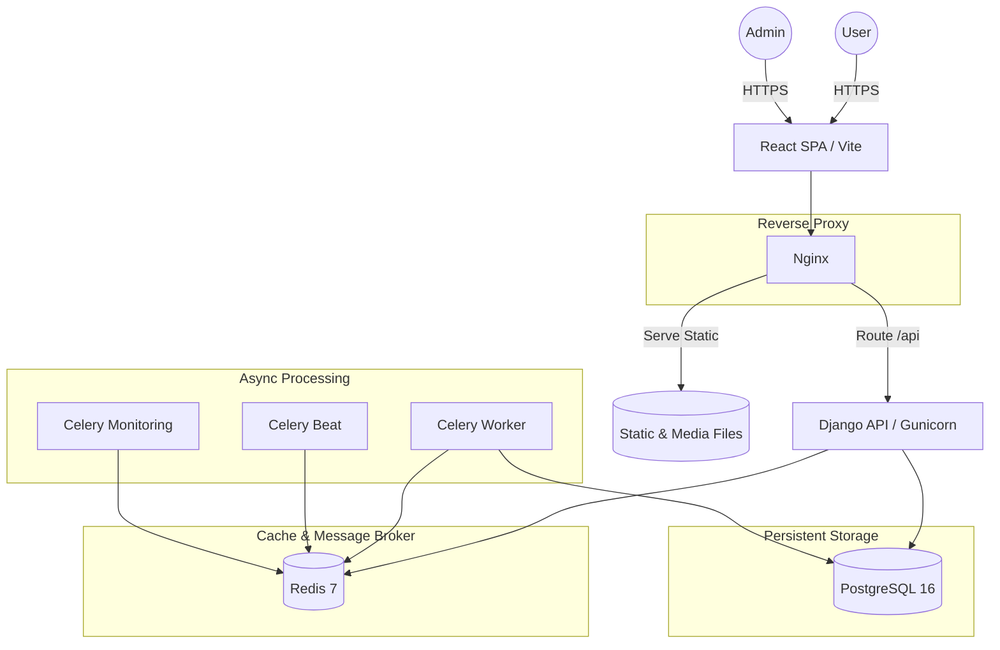

<div align="center">
  
  <h1>👟 SneakIn — Premium E-Commerce Platform</h1>
  <p><b>A high-performance, enterprise-ready sneaker marketplace built with Django 5 and React 19.</b></p>

  <p>
    
    
    
    
    
    
    
    
    
  </p>
</div>

---

## 📖 Introduction

**SneakIn** is a sophisticated full-stack e-commerce solution designed precisely for the sneaker industry. It features a sleek, high-conversion storefront for customers and a high-efficiency dashboard for administrators. The system is built on a decoupled architecture, ensuring scalability, security, and exceptional performance.

### ✨ Key Value Propositions
- **Architectural Excellence**: Clean separation between React frontend and Django REST backend.
- **Asynchronous Scalability**: Background processing via Celery for heavy tasks and reporting.
- **Production Ready**: Full Docker orchestration, security hardening, and CI/CD validation.
- **Admin Precision**: A dedicated admin module with a strict 90-degree "sharp" UI for administrative focus.

---

## 🛠️ Technology Stack

### **Backend (The Engine)**
- **Framework**: [Django 5.1.6](https://www.djangoproject.com/) for a robust, batteries-included core.
- **API Layer**: [Django REST Framework](https://www.django-rest-framework.org/) for clean, paginated, and filtered JSON endpoints.
- **Auth**: [SimpleJWT](https://django-rest-framework-simplejwt.readthedocs.io/) for high-security stateless token authentication.
- **Async Workers**: [Celery](https://docs.celeryq.dev/) with [Redis](https://redis.io/) for reporting and background signals.
- **Monitoring**: [Sentry](https://sentry.io/) for error tracking and [Prometheus](https://prometheus.io/) for metrics.
- **Documentation**: [drf-spectacular](https://drf-spectacular.readthedocs.io/) providing interactive Swagger & Redoc.

### **Frontend (The Experience)**
- **Core**: [React 19](https://react.dev/) using modern Hooks and Context API for global state.
- **Build Engine**: [Vite 7](https://vitejs.dev/) for lightning-fast development and optimized bundles.
- **Styling**: [TailwindCSS 4](https://tailwindcss.com/) for a precise, utility-first design system.
- **Navigation**: [React Router 7](https://reactrouter.com/) for declarative client-side routing.
- **Charts**: [Chart.js](https://www.chartjs.org/) for data visualization on the Admin Dashboard.
- **UI Notifications**: [React Toastify](https://fkhadra.github.io/react-toastify/) for real-time user feedback.

---

## 🏗️ System Architecture



---

## 📂 Project Structure

```text
.
├── backend/                    # 🐍 Django Backend Project
│   ├── apps/
│   │   ├── accounts/           # Auth, User Roles, Health Checks
│   │   ├── products/           # Inventory, Brands, Categories
│   │   ├── orders/             # Checkout, Status management, Reports
│   │   ├── cart/               # Persistent cart management
│   │   ├── wishlist/           # User favorites
│   │   └── notifications/      # Real-time Admin alerts
│   ├── config/                 # Core settings (base/dev/prod), URLs, WSGI/ASGI
│   ├── requirements.txt        # Backend dependencies
│   └── Dockerfile              # Production image definition
│
├── e-commerce-app/             # ⚛️ React Frontend Project
│   ├── src/
│   │   ├── admin/              # Specialized Admin Dashboard module
│   │   ├── components/         # Reusable UI components
│   │   ├── context/            # Auth and Global State providers
│   │   ├── pages/              # Storefront pages
│   │   └── assets/             # Images, Global styles
│   ├── package.json            # Frontend dependencies
│   └── vite.config.js          # Build & Plugin configuration
│
├── docker-compose.yml          # 🐳 Multi-service orchestration
├── lint.sh                     # 🛡️ Local CI validation script
└── .env.example                # ⚙️ Environment variable template
```

---

## 🚀 Features Deep Dive

### **🛒 Customer Storefront**
- **Intuitive Browsing**: Search, search filters by category/subcategory/brand, and intelligent sorting.
- **Deep Wishlist**: authenticated users can save favorites across sessions.
- **Dynamic Cart**: Persistent cart management with real-time stock validation and quantity updates.
- **Secure Checkout**: Streamlined order placement with snapshot-based order data (prices locked at purchase).
- **Order Tracking**: Comprehensive order history with real-time status updates from the warehouse.

### **🛡️ Admin Dashboard (The Nerve Center)**
- **Sales Intelligence**: Real-time sales charts and revenue summaries.
- **Inventory Control**: Full CRUD management of products, images, and sizing.
- **Order Management**: Surgical control over order statuses (Confirm, Ship, Deliver, Cancel).
- **User Oversight**: Management of user roles and the ability to block/unblock accounts.
- **Asynchronous Reports**: Daily sales summaries automatically generated and emailed to admins via Celery.
- **Sharp Design**: A focused "90-degree corner" aesthetic ensuring a premium administrative experience.

---

## ⚙️ Getting Started

### **Way A: Docker Compose (Highly Recommended)**
Recommended for development and production-like local testing.

1. **Setup Environment**:
   ```bash
   cp .env.example .env
   # Update .env with your preferred credentials
   ```
2. **Launch Services**:
   ```bash
   docker-compose up --build
   ```
3. **Initialize Database**:
   ```bash
   docker-compose exec backend python manage.py migrate
   docker-compose exec backend python manage.py createsuperuser
   ```
4. **Access Applications**:
   - Storefront: `http://localhost:5173`
   - API Docs: `http://localhost:8000/api/docs/`
   - Celery Monitoring: `http://localhost:5555`

---

### **Way B: Manual Setup**

#### **1. Backend Setup**
```bash
cd backend
python -m venv venv
source venv/bin/activate
pip install -r requirements.txt
# (Ensure Postgres & Redis are running locally)
python manage.py migrate
python manage.py runserver
```

#### **2. Frontend Setup**
```bash
cd e-commerce-app
npm install
npm run dev
```

---

## 🛡️ Quality Assurance (CI/CD)

We maintain code quality through a dual validation layer:

1. **Local Validation**: Run `bash lint.sh` before pushing. This executes:
   - **Flake8**: Backend style checks.
   - **Pytest**: Full backend logic and integration tests.
   - **Vite Build**: Verifies the frontend compiles correctly.
2. **Automated Pipeline**: GitHub Actions runs the same suite on every pull request, ensuring the `main` branch is always stable.

---

## 🔗 Internal API Endpoints

| Category | Endpoint | Description |
|---|---|---|
| **Auth** | `/api/auth/login/` | Secure JWT Authentication |
| **Catalog** | `/api/products/` | Paginated product listing with filters |
| **Orders** | `/api/orders/place/` | Customer checkout endpoint |
| **Admin** | `/api/admin/dashboard/` | Core administrative metrics |
| **Health** | `/api/health/` | Service status (DB & Redis check) |

---

<div align="center">
  <p><b>SneakIn</b> — Precision Engineered by the Team</p>
  <p>Licensed under <b>MIT</b></p>
</div>